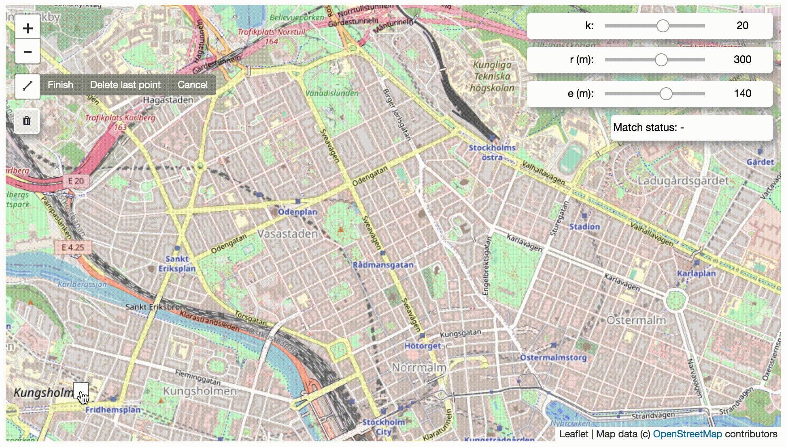
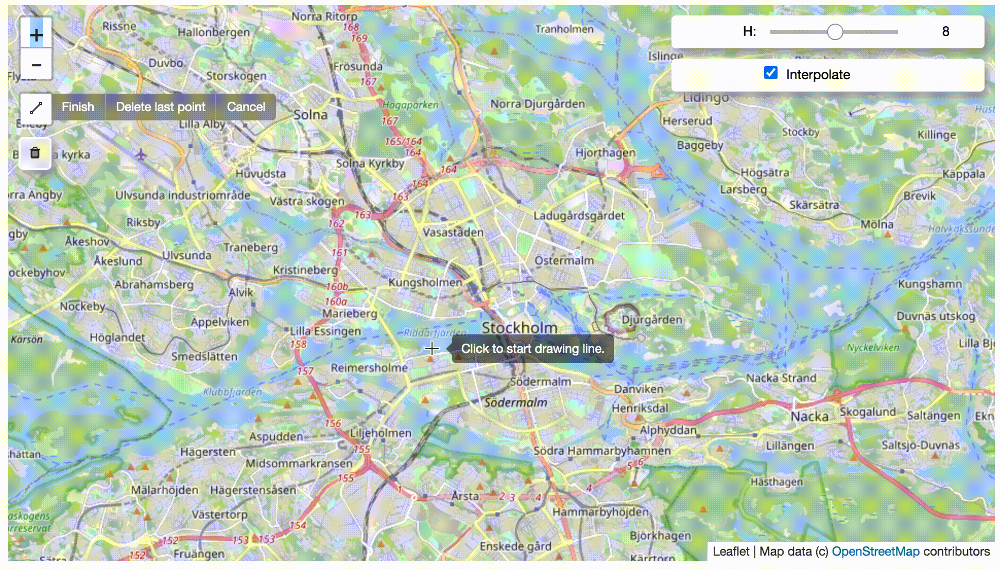
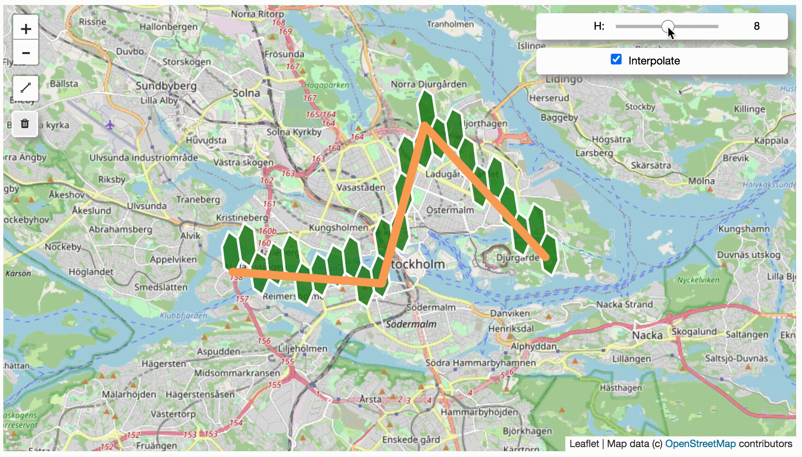

### fmm-examples

This repository contains a collection of fmm examples in Jupyter-notebook. 

#### Python packages used

- [fmm](https://github.com/cyang-kth/fmm): Fast map matching framework (Python binding used here)
- [ipyleaflet](https://github.com/jupyter-widgets/ipyleaflet): Interactive map in Jupyter-notebook
- [ipywidget](https://github.com/jupyter-widgets/ipywidgets): Interactive widget in Jupyter-notebook
- [folium](https://github.com/python-visualization/folium): More fluent dual map visualization
- [shapely](https://github.com/Toblerity/Shapely): Geometry conversion
- [osmnx](https://github.com/gboeing/osmnx): Download road network from OpenStreetMap into Shapefile format
- Tested on Ubuntu 14.04 and Python 2.7 and Python 3, which is only used in 1-download_network.ipynb

#### List of examples

- 1-download_network.ipynb. Download OSM road network for a region
- 2-map_match_interactive.ipynb. Interactive map matching
- 3-hex_match_interactive.ipynb. Interactive hexagon matching

#### Screenshots

Map match to OSM road network by drawing

Explore the factor of candidate size k, search radius and GPS error

Explore with dual map

Map match to hexagon by drawing

Explore the factor of hexagon level and interpolate

