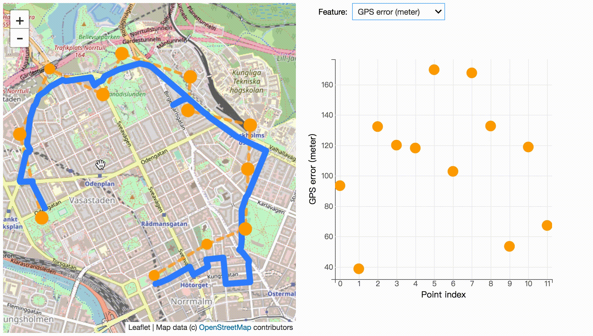

### fmm-examples

This repository contains a collection of fmm examples in Jupyter-notebook.

#### Python packages used

* [fmm](https://github.com/cyang-kth/fmm): Fast map matching framework (Python binding used here)
* [ipyleaflet](https://github.com/jupyter-widgets/ipyleaflet): Interactive map in Jupyter-notebook
* [ipywidget](https://github.com/jupyter-widgets/ipywidgets): Interactive widget in Jupyter-notebook
* [folium](https://github.com/python-visualization/folium): More fluent dual map visualization
* [shapely](https://github.com/Toblerity/Shapely): Geometry conversion
* [osmnx](https://github.com/gboeing/osmnx): Download road network from OpenStreetMap into Shapefile format
* [bqplot](https://github.com/bqplot/bqplot): 2-D plotting library for Project Jupyter
* [Pandas](https://github.com/pandas-dev/pandas): Python data analysis library
* [Numpy](https://github.com/numpy/numpy): Numeric computation library
* [Geopandas](https://github.com/geopandas/geopandas): Python GeoSpatial data analysis library

- Tested on Ubuntu 14.04 and Python 2.7 and Python 3 (Python 3 is only used in 1-download_network.ipynb to download network data)

A dataset is provided at [data.tar.gz](data/stockholm/data.tar.gz).

#### List of examples

- 1-download_network.ipynb. Download OSM road network for a region
- 2-map_match_interactive.ipynb. Interactive map matching
- 3-hex_match_interactive.ipynb. Interactive hexagon matching
- 4-explore_detailed_mapmatching.ipynb. Interactive exploring details of map matching
result including gps error, shortest path distance, etc.

#### Screenshots

Map match to OSM road network by drawing, [link](2-map_match_interactive.ipynb)

Explore the factor of candidate size k, search radius and GPS error, [link](2-map_match_interactive.ipynb)

Explore detailed map matching information, [link](4-explore_detailed_mapmatching.ipynb)

Explore with dual map, [link](2-map_match_interactive.ipynb)

Map match to hexagon by drawing, [link](3-hex_match_interactive.ipynb)

Explore the factor of hexagon level and interpolate, [link](3-hex_match_interactive.ipynb)

